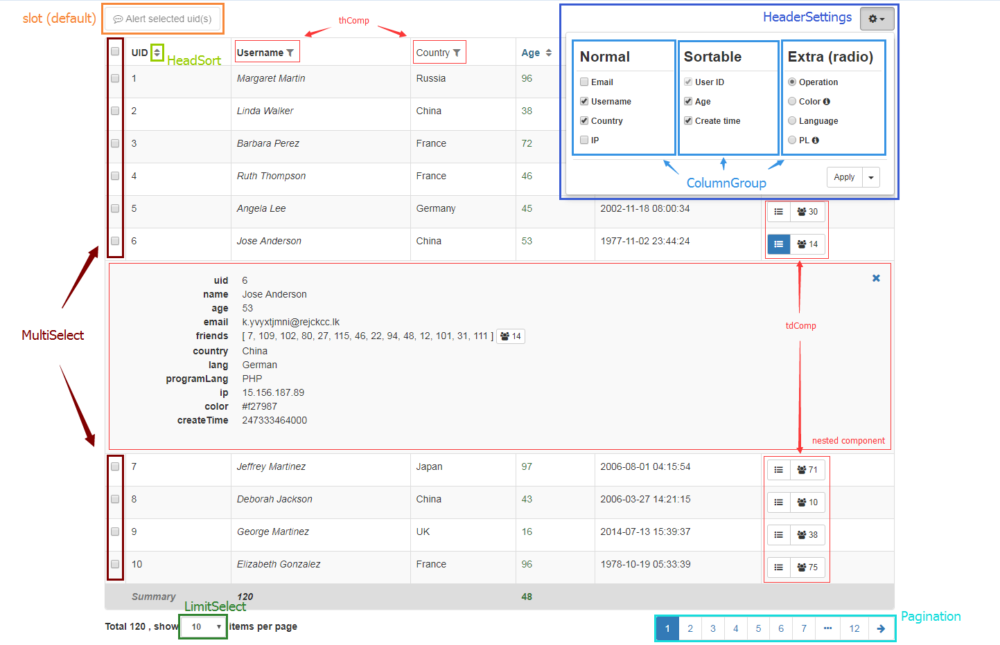

# § Detailed

It would be better for you to understand the structure of this Datatable before the detailed content.

The source tree [`lib/`](https://github.com/OneWayTech/vue2-datatable/tree/master/lib) shown as below:

```
lib/
 ├─ HeaderSettings/
 │   ├─ ColumnGroup.vue
 │   └─ index.vue
 ├─ HeadSort.vue
 ├─ LimitSelect.vue
 ├─ MultiSelect.vue
 ├─ Pagination.vue
 └─ index.vue
```

Let's look at the structure of the advanced example (source - [`examples/src/Advanced/index.vue`](https://github.com/OneWayTech/vue2-datatable/blob/master/examples/src/Advanced/index.vue), demo - [examples#advanced](https://OneWayTech.github.io/vue2-datatable/examples/dist#advanced))

<a href="images/structure.png" target="_blank">
  
</a>
