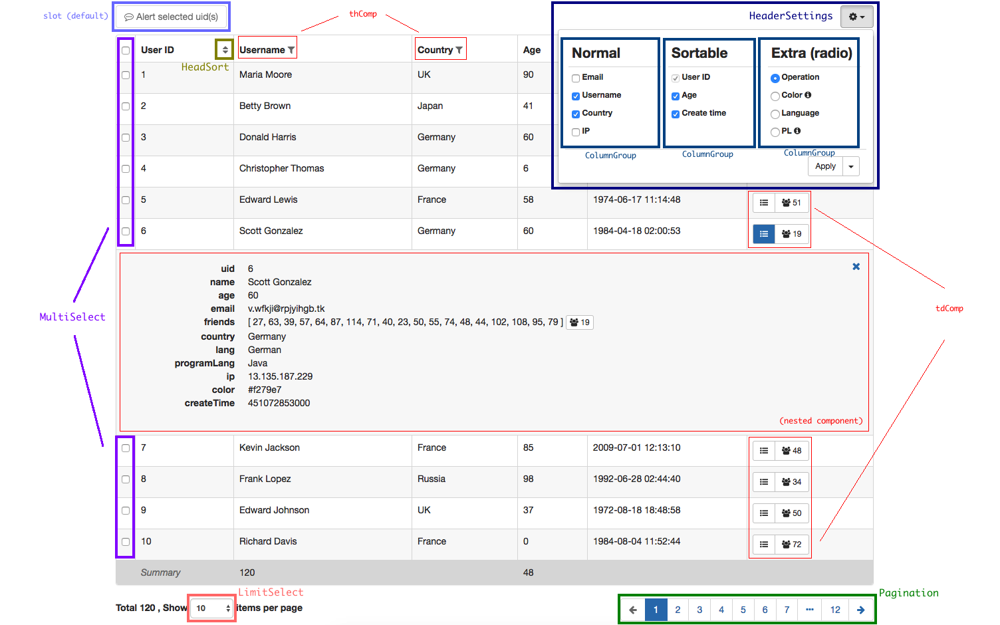

# § 详解

在讲解配置项前，我们先来了解一下本 Datatable 的构造

源码目录树 [`lib/`](https://github.com/OneWayTech/vue2-datatable/tree/master/lib) 如下所示：

```
lib/
 ├─ HeaderSettings/     # 表头设置
 │   ├─ ColumnGroup.vue   # 表头设置分栏组件
 │   └─ index.vue         # 表头设置主体
 ├─ HeadSort.vue        # 排序
 ├─ LimitSelect.vue     # 每页显示记录数下拉选择框
 ├─ MultiSelect.vue     # 行首多选框
 ├─ Pagination.vue      # 分页
 └─ index.vue           # Datatable 主体
```

以高级例子 [`examples/src/Advanced/index.vue`](https://github.com/OneWayTech/vue2-datatable/blob/master/examples/src/Advanced/index.vue) ([demo - examples#advanced](https://OneWayTech.github.io/vue2-datatable/examples/dist#advanced)) 为例，标注出对应的基本构成组件如下图所示：


